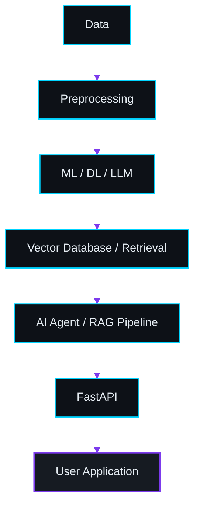

<div align="center">

<h1>Hi, I'm Muawiyah 👋</h1>

<a href="https://git.io/typing-svg">
  
</a>

<p><i>Building intelligent systems with Machine Learning, Deep Learning, Generative AI &amp; Python.</i></p>

<p>
  <a href="https://www.linkedin.com/in/muawiyah-8431552a1"></a>
  <a href="https://ai-powered-portfolio-sigma.vercel.app"></a>
  <a href="mailto:muawiyah9570@gmail.com"></a>
</p>

</div>

---

## About Me

I'm a **Data Science / Computer Science student** focused on building **real-world AI applications**, and I enjoy turning ML and AI concepts into **deployable products** rather than leaving them in notebooks.

My work spans **Python · Data Science · Machine Learning · Deep Learning · Generative AI · LLMs · RAG · AI Agents · Backend/API development**.

---

## 🧠 What I'm Working On

```text
→ Generative AI applications
→ Retrieval-Augmented Generation (RAG)
→ AI agents and multi-agent systems
→ LLM-powered applications
→ FastAPI AI backends
→ Production-ready ML systems
```

---

## Tech Stack

<table>
  <tr>
    <td align="right" nowrap><b>Programming</b></td>
    <td>
      
      
    </td>
  </tr>
  <tr>
    <td align="right" nowrap><b>AI / ML</b></td>
    <td>
      
      
    </td>
  </tr>
  <tr>
    <td align="right" nowrap><b>Data &amp; Viz</b></td>
    <td>
      
      
      
      
    </td>
  </tr>
  <tr>
    <td align="right" nowrap><b>Generative AI</b></td>
    <td>
      
      
      
      
      
      
      
    </td>
  </tr>
  <tr>
    <td align="right" nowrap><b>Backend</b></td>
    <td>
      
      
      
    </td>
  </tr>
  <tr>
    <td align="right" nowrap><b>Databases</b></td>
    <td>
      
      
    </td>
  </tr>
  <tr>
    <td align="right" nowrap><b>Tools</b></td>
    <td>
      
      
      
    </td>
  </tr>
</table>

---

## ⚡ How I Build AI Systems



---

## Featured Projects

<table>
  <tr>
    <td width="50%" valign="top">
      <h3>AI-Powered Portfolio</h3>
      <p>Portfolio with a RAG-grounded AI assistant, AI Architecture Lab, Recruiter Mode, developer CLI and a global command palette.</p>
      <p><code>Next.js</code> · <code>FastAPI</code> · <code>RAG</code> · <code>TypeScript</code></p>
      <a href="https://github.com/muawiyah-codes/AI-Powered-Portfolio"></a>
    </td>
    <td width="50%" valign="top">
      <h3>Skin Disease Classification</h3>
      <p>9-class skin disease classifier with Grad-CAM explainability and out-of-domain rejection. <b>96.77% test accuracy.</b></p>
      <p><code>EfficientNetV2B0</code> · <code>Transfer Learning</code> · <code>Grad-CAM</code> · <code>Streamlit</code></p>
      <a href="https://github.com/muawiyah-codes/Multi-Skin-Disease-Classification"></a>
    </td>
  </tr>
  <tr>
    <td width="50%" valign="top">
      <h3>DocuMind AI</h3>
      <p>RAG document assistant that retrieves diverse, relevant context with MMR and grounds LLM answers in your documents.</p>
      <p><code>LangChain</code> · <code>HF Embeddings</code> · <code>Chroma</code> · <code>MMR</code> · <code>Streamlit</code></p>
      <!-- TODO: replace this link with the exact DocuMind AI repository URL -->
      <a href="https://github.com/muawiyah-codes?tab=repositories"></a>
    </td>
    <td width="50%" valign="top">
      <h3>ResearchMind</h3>
      <p>Multi-agent research system: Search, Reader, Writer and Critic agents turn a topic into a structured, critiqued report.</p>
      <p><code>LangChain</code> · <code>Groq</code> · <code>Tavily</code> · <code>Streamlit</code></p>
      <a href="https://github.com/muawiyah-codes/Multi-agent-research-system"></a>
    </td>
  </tr>
  <tr>
    <td width="50%" valign="top">
      <h3>Aura Underwrite</h3>
      <p>Insurance risk-tier classification and premium quoting served through a validated, production-style API.</p>
      <p><code>Scikit-learn</code> · <code>Random Forest</code> · <code>FastAPI</code> · <code>Pydantic</code></p>
      <a href="https://github.com/muawiyah-codes/AI-Insurance-Premium-Prediction"></a>
    </td>
    <td width="50%" valign="top">
      <h3>Student Placement Prediction</h3>
      <p>Predicts placement status from academic and skill data with regularized logistic regression.</p>
      <p><code>Scikit-learn</code> · <code>Logistic Regression</code> · <code>Pandas</code> · <code>Streamlit</code></p>
      <a href="https://github.com/muawiyah-codes/Student-Placement-Prediction"></a>
    </td>
  </tr>
</table>

---

## 📊 GitHub Analytics

<div align="center">
  
  
  <br/>
  
</div>

---

## Contribution Activity

<div align="center">
  <picture>
    <source media="(prefers-color-scheme: dark)" srcset="https://raw.githubusercontent.com/muawiyah-codes/muawiyah-codes/output/github-snake-dark.svg" />
    <source media="(prefers-color-scheme: light)" srcset="https://raw.githubusercontent.com/muawiyah-codes/muawiyah-codes/output/github-snake.svg" />
    
  </picture>
</div>

---

## Developer Terminal

```text
muawiyah@github:~$ whoami
AI/ML & Generative AI Developer

muawiyah@github:~$ current_focus
> LLM Applications
> RAG Systems
> AI Agents
> Machine Learning
> FastAPI Backends

muawiyah@github:~$ mission
> Build AI systems that solve real-world problems.
```

---

## 🤝 Let's Connect

<div align="center">

<p>
  <a href="https://www.linkedin.com/in/muawiyah-8431552a1"></a>
  <a href="https://github.com/muawiyah-codes"></a>
  <a href="mailto:muawiyah9570@gmail.com"></a>
  <a href="https://ai-powered-portfolio-sigma.vercel.app"></a>
</p>

<i>Open to opportunities in AI/ML, Generative AI and Python development.</i>

</div>
